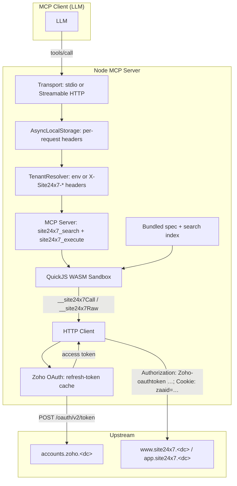

# Architecture

This MCP server follows the [code-mode](https://blog.cloudflare.com/code-mode/) pattern: instead of registering hundreds of MCP tools (one per Site24x7 endpoint), it exposes **two** — `site24x7_search` and `site24x7_execute` — and lets the LLM write JavaScript that runs inside a sandboxed QuickJS WASM context. The sandbox calls real Site24x7 REST endpoints through opaque host-provided shims.

This is the same architecture as the sibling [`make-code-mode-mcp`](https://github.com/jmpijll/make-code-mode-mcp), [`unraid-code-mode-mcp`](https://github.com/jmpijll/unraid-code-mode-mcp), [`unifi-code-mode-mcp`](https://github.com/jmpijll/unifi-code-mode-mcp), and [`fortimanager-code-mode-mcp`](https://github.com/jmpijll/fortimanager-code-mode-mcp). What's specific to Site24x7:

1. **Zoho OAuth 2.0** with a permanent Self Client refresh token, swapped for a short-lived access token per zone.
2. **MSP / Business Unit tenancy as a first-class second axis** of the tenant model. One OAuth identity can act against many customers — the `zaaid` rides on `TenantContext` and the HTTP client always injects it as a cookie.
3. **No public OpenAPI spec.** Site24x7 publishes the REST reference as HTML only. We scrape it at build time into a bundled JSON spec; the loader never hits the network at runtime.

## Module map

```text
src/
├── index.ts                       # Entry point; wires config, spec, server, transport
├── config.ts                      # Zod-validated env config
├── auth/
│   └── zoho-oauth.ts              # Per-tenant refresh-token → access-token cache
├── client/
│   ├── http.ts                    # undici HTTP client (Zoho-oauthtoken, version=2.0, zaaid cookie)
│   ├── factory.ts                 # TenantContext → bound HTTP client
│   └── types.ts                   # Site24x7HttpError + shared types
├── tenant/
│   └── context.ts                 # Build TenantContext from env or X-Site24x7-* headers
├── spec/
│   ├── loader.ts                  # Bundle-only loader, schema-versioned cache
│   ├── index-builder.ts           # JSON spec → IndexedOperation[]
│   ├── index.ts                   # Search / lookup helpers
│   └── site24x7-fallback.json     # Bundled scraped spec
├── sandbox/
│   ├── search-executor.ts         # Sync sandbox for `site24x7_search`
│   ├── execute-executor.ts        # Async sandbox for `site24x7_execute`
│   ├── dispatch.ts                # site24x7.* prelude + withCustomer semantics
│   └── limits.ts                  # Time / memory / call-budget caps
├── server/
│   ├── server.ts                  # MCP server factory; registers the two tools
│   ├── transport.ts               # stdio + Streamable HTTP transports
│   └── request-context.ts         # AsyncLocalStorage scope for HTTP headers
└── types/
    ├── tenant.ts                  # TenantContext, MissingCredentialsError, MissingZaaidError
    └── zones.ts                   # KNOWN_SITE24X7_ZONES (11 entries)
```

## High-level data flow



## Request lifecycle

1. MCP client invokes `tools/call` for `site24x7_search` or `site24x7_execute` with a single `code` string.
2. The transport hands the raw HTTP headers to `request-context.ts`, which stashes them in an `AsyncLocalStorage` slot for the duration of the request.
3. The tool handler resolves a `TenantContext` from the ALS slot (HTTP mode) or from `loadConfig().env*` (stdio mode). A bad zone or missing credential throws `MissingCredentialsError` immediately — surfaced inside the sandbox as an actionable error, never as a 5xx.
4. A per-request `ExecuteExecutor` (or `SearchExecutor`) is constructed. It binds a `__site24x7Call(...)` host shim to the QuickJS context.
5. The sandbox runs the LLM's JS. Calls to `site24x7.<tag>.<op>(args)` / `site24x7.request(...)` go through the prelude to `__site24x7Call`, which:
   - Looks up the operation in the spec index (typed calls) or substitutes path placeholders (raw).
   - Hands the resolved `(method, url, query, body)` to the HTTP client built around the current `TenantContext`.
6. The HTTP client asks `auth/zoho-oauth.ts` for an access token (cached per `tenantCacheKey`, refreshed before its 1-hour expiry), and dispatches:
   - `Authorization: Zoho-oauthtoken <access-token>`
   - `Accept: application/json; version=2.0`
   - `Cookie: zaaid=<id>` when `TenantContext.zaaid` is set or when wrapped in `withCustomer(...)`.
7. Response JSON is parsed and returned to the sandbox. Final expression of the IIFE is the tool result.

## Key design choices

### Two tools, not 400

Registering one tool per operation would mean ~400 entries in the MCP tools list — every one consuming tokens in the model's context window and every one needing per-operation typing the LLM has to reason about. Code mode collapses that into one search tool and one execute tool. The model writes real JavaScript, the host executes it, and the tool list stays tiny.

### Bundled scraped spec, not live OpenAPI

Site24x7 publishes its REST reference as HTML at `https://www.site24x7.com/help/api/`. There is no machine-readable OpenAPI document — verified by looking at the docs page and by the Site24x7 forum. `scripts/update-spec.ts` parses the docs and emits `src/spec/site24x7-fallback.json` at build time, preserving each operation's `requiredScopes` (from the doc's `oauthscope` line) and `mspOnly` / `buOnly` flags. The runtime loader never hits the network; rebundling is a deliberate maintainer action (`npm run update-spec`).

### Sandbox is QuickJS WASM (or a Worker isolate)

[`quickjs-emscripten`](https://github.com/justjake/quickjs-emscripten) provides an isolated JavaScript context with no access to the network, the filesystem, `process`, `require`, `import`, `eval`, or `Function`. The only ambient capability the sandbox sees is the `site24x7.*` proxy assembled from the spec index.

The Cloudflare Worker entrypoint in `cf-worker/` uses a Worker Loader isolate instead. Same isolation semantics, different runtime.

### `TenantContext` + `AsyncLocalStorage`

`TenantContext` is the full set of inputs the HTTP client needs to make a single authenticated call: `clientId`, `clientSecret`, `refreshToken`, `zone`, `accountType`, and optionally `zaaid`. It is **rebuilt on every MCP request**, lives only in an `AsyncLocalStorage` scope, and is garbage-collected when the request ends. Two interleaved HTTP requests on the same Node process cannot share credentials.

`tenantCacheKey(ctx)` (defined in `src/tenant/context.ts`) keys the in-memory access-token cache on `${zone}|${clientId}|${refreshToken}`. The `zaaid` is intentionally **not** in the key — the access token is issued against the OAuth identity, not the customer, and is reusable across customers.

### `zaaid` is first-class

Site24x7's MSP / BU surface scopes every call by setting `Cookie: zaaid=<customer_id>`. This server treats that as a property of `TenantContext`, not as a per-call argument:

- `SITE24X7_ZAAID` env var or `X-Site24x7-Zaaid` HTTP header sets a default for the request.
- `site24x7.withCustomer(zaaid, fn)` pushes a new `zaaid` onto a per-request stack for the duration of the closure, then pops it. Nested `withCustomer` calls work as you'd expect.
- The HTTP client reads the active `zaaid` (closure top-of-stack, else `TenantContext.zaaid`, else none) and injects it as a cookie on every wire call.
- Calling an operation flagged `mspOnly: true` (or `buOnly: true`) without a `zaaid` in scope throws `MissingZaaidError` inside the sandbox with a `listCustomers()` hint, before the wire call goes out.

See [`multi-tenant.md`](multi-tenant.md) for the full ergonomics.

### Scope-aware errors

Each `IndexedOperation` carries the `oauthscope` requirement scraped from the docs (e.g. `Site24x7.Admin.All`). When the HTTP client sees a `403` on a typed call, it decorates the error with that scope name. The model gets:

```text
[site24x7.HttpError] HTTP 403 on /api/monitors: ... (operation requires scope `Site24x7.Admin.All` — your refresh token lacks it)
```

Raw `site24x7.request(...)` calls don't have an operation context, so their 403s are unannotated.

### One refresh token = one OAuth identity = one Site24x7 zone

A Zoho refresh token is minted against a specific data centre (US / EU / IN / …). It does not work cross-zone. The server therefore models `(refreshToken, zone)` as a single OAuth identity. If you operate against more than one zone, register one MCP entry per zone — each with its own refresh token. The 11 known zones live in `KNOWN_SITE24X7_ZONES` (`src/types/zones.ts`); each maps to a `(accountsBaseUrl, apiBaseUrl)` pair. Don't hardcode either set elsewhere.

## Cloudflare Workers entrypoint

`cf-worker/` ships a Worker scaffold for parity with the sibling repos. The transport adapter is currently a 501 placeholder; routing, header-validation, and the spec loader paths are functional. Full Streamable-HTTP transport on Workers is roadmap (see [`AGENTS.md`](../AGENTS.md) §10).
