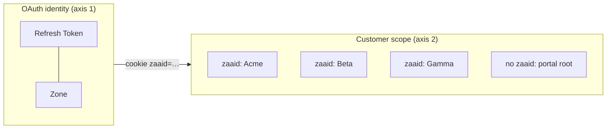
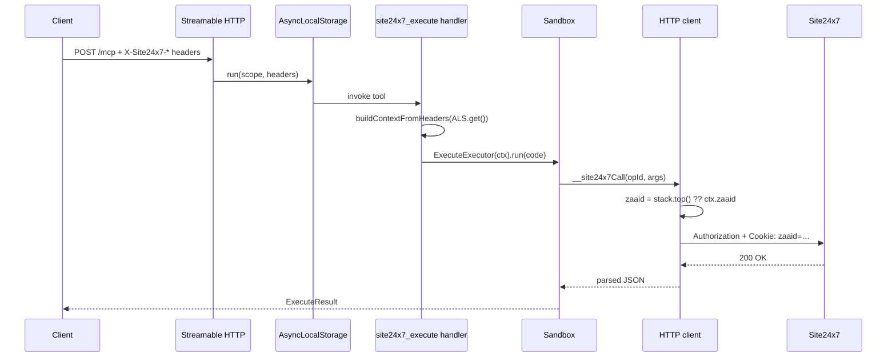

# Multi-tenant deployment

Site24x7 tenancy has **two independent axes**. Both are first-class in this server.



| Axis | What it identifies | Set via |
|---|---|---|
| OAuth identity | A Zoho user / portal in one data centre | `clientId` + `clientSecret` + `refreshToken` + `zone` |
| Customer scope (MSP/BU) | A specific customer or business unit under that portal | `zaaid` (cookie) — optional for standard accounts |

A standard Site24x7 account uses axis 1 only. An MSP or BU portal user uses both: one OAuth identity, many customers.

## Two operating modes

| Mode | Trigger | Credentials from | Use when |
|---|---|---|---|
| **Single-user** | `MCP_TRANSPORT=stdio` (default) | `SITE24X7_*` env vars | One operator, one Zoho identity, one zone |
| **Multi-tenant** | `MCP_TRANSPORT=http` | Per-request `X-Site24x7-*` HTTP headers | Hosted gateway, shared infra, multiple operators or zones |

The server runs the same `TenantContext` resolver in both modes — only the source of the values differs (`src/tenant/context.ts`).

## HTTP header contract

When `MCP_TRANSPORT=http`, the server listens on `MCP_HTTP_PORT` (default `8000`) and reads credentials from request headers. The full contract:

| Header | Required | Notes |
|---|---|---|
| `X-Site24x7-Client-Id` | yes | Zoho Self Client client ID |
| `X-Site24x7-Client-Secret` | yes | Zoho Self Client client secret |
| `X-Site24x7-Refresh-Token` | yes | Permanent refresh token |
| `X-Site24x7-Zone` | yes | One of `com`, `eu`, `in`, `com.au`, `cn`, `jp`, `ca`, `uk`, `ae`, `sa` |
| `X-Site24x7-Zaaid` | no | Default MSP customer / BU `zaaid` for this request. `withCustomer(...)` inside the sandbox can still override. |
| `X-Site24x7-Account-Type` | no | `standard` / `msp` / `bu`. Default `standard`. Only used to make `MissingZaaidError` messages clearer. |

Equivalent env vars for stdio / single-user mode:

```dotenv
SITE24X7_CLIENT_ID=…
SITE24X7_CLIENT_SECRET=…
SITE24X7_REFRESH_TOKEN=…
SITE24X7_ZONE=com
SITE24X7_ZAAID=…              # optional
SITE24X7_ACCOUNT_TYPE=msp     # optional, default 'standard'
```

Missing required values produce a `MissingCredentialsError` **inside the sandbox** the first time the user code dispatches a host call, with a list of what's missing. Tool calls themselves still succeed (so the model can still call `site24x7_search` against the bundled spec), but any `site24x7_execute` script that touches the wire fails loudly with an actionable message.

## Per-request scoping

Every MCP request is wrapped in a Node `AsyncLocalStorage` scope (`src/server/request-context.ts`). The tenant resolver reads the ALS slot and builds a fresh `TenantContext` from headers. Two requests interleaved on the same Node process never share credentials — including their `zaaid`.



## MSP / BU ergonomics in the sandbox

Three sandbox primitives cover the MSP/BU surface. All live on the `site24x7.*` namespace alongside the typed operation accessors.

```ts
site24x7.listCustomers()                          // GET /api/short/msp/customers
                                                  // (or /api/short/bu/business_units in BU mode)
                                                  // returns [{ name, zaaid, ... }]

site24x7.withCustomer(zaaid, function (s) { … })  // Pushes zaaid for the duration of fn.
                                                  // `s` is the same flat surface, scoped.
                                                  // Synchronous: returns whatever fn
                                                  // returns; pops on return / throw.

site24x7.zaaid                                    // Active zaaid getter (top-of-stack
                                                  // → TenantContext.zaaid → undefined).
```

`withCustomer` works like a stack:

```js
site24x7.withCustomer('A', function (s) {
  console.log(s.zaaid);                          // 'A'
  site24x7.withCustomer('B', function (s2) {
    console.log(s2.zaaid);                       // 'B'
  });
  console.log(s.zaaid);                          // 'A' again
});
```

### Calling an MSP/BU-only operation without a `zaaid`

Each `IndexedOperation` carries `mspOnly` / `buOnly` flags derived from the doc's `oauthscope` line (`Site24x7.Msp.*` and `Site24x7.Bu.*`). If the LLM calls one of those without a `zaaid` in scope, the host throws before the wire call:

```text
[site24x7.MissingZaaidError] operation "listMspCustomers" requires a zaaid
in scope (operation is mspOnly=true, current accountType=msp). Hint: call
site24x7.listCustomers() and wrap the call in site24x7.withCustomer(zaaid, ...).
```

The error is surfaced inside the sandbox so the model has actionable feedback. See `MissingZaaidError` in `src/types/tenant.ts`.

## Recipes

### Enumerate customers

```js
site24x7.listCustomers();
```

Returns `[{ name, zaaid, ... }]` from `/api/short/msp/customers` (or `/api/short/bu/business_units` if `accountType=bu`).

### Act against a single named customer

```js
var customers = site24x7.listCustomers();
var target = customers.find(function (c) { return c.name === 'Acme Corp'; });
if (!target) throw new Error('customer not found');
site24x7.withCustomer(target.zaaid, function (s) {
  return s.monitors.list();
});
```

### Fan out across every customer

```js
var customers = site24x7.listCustomers();
var summary = [];
for (var i = 0; i < customers.length; i++) {
  var c = customers[i];
  var status = site24x7.withCustomer(c.zaaid, function (s) {
    return s.request({ method: 'GET', path: '/api/current_status' });
  });
  summary.push({
    customer: c.name,
    zaaid: c.zaaid,
    down: (status && status.monitors_status && status.monitors_status.down) || 0,
  });
}
summary;
```

Note the per-execute call budget (default `50`, `SITE24X7_MAX_CALLS_PER_EXECUTE`). For sweeps that exceed it, raise the budget or paginate across multiple `site24x7_execute` invocations.

### Standard (non-MSP) account

Don't set `zaaid` anywhere. The HTTP client omits the cookie and the call hits the portal root. `mspOnly` / `buOnly` operations will throw with a `MissingZaaidError` — that's correct: they require an MSP/BU portal regardless of how you authenticated.

### MSP portal root vs per-customer

Some MSP endpoints (e.g. listing customers themselves) operate on the **portal root**, not on a specific customer. Don't wrap those in `withCustomer`. The spec marks customer-scoped operations with `mspOnly: true`; portal-root operations are unflagged.

If you accidentally call a portal-root op inside `withCustomer`, the cookie is sent but harmlessly ignored by Site24x7.

## Edge cases and gotchas

- **One OAuth identity per refresh token, per zone.** A token minted in the EU console will not work against `accounts.zoho.com`. If you operate two zones, register two MCP entries.
- **`zaaid` is a cookie on the wire, not a header.** `X-Site24x7-Zaaid` is **our** server's HTTP header (multi-tenant input); the upstream Site24x7 API only reads `Cookie: zaaid=<id>`. Don't try to set the cookie from the sandbox — the HTTP client does it for you.
- **Access tokens are zone- and identity-scoped, not customer-scoped.** The in-memory cache key is `${zone}|${clientId}|${refreshToken}`. One access token is reused across all `zaaid`s for the same identity.
- **`withCustomer` returns a Promise.** Always `await` it. Forgetting to `await` leaks the zaaid override into surrounding code.
- **The HTTP transport does not implement per-tenant rate limiting** (yet — see [`AGENTS.md`](../AGENTS.md) §10). If you need per-tenant limits, terminate them at your proxy.

## Why this shape

- **One MCP entry, many customers.** An MSP operator drives every customer from a single server registration; the MCP client only sees one set of tools.
- **No long-lived secrets in the agent's config.** In HTTP mode the agent only speaks MCP — the Zoho credentials live with the calling client (per-tenant).
- **Stdio for single-operator simplicity.** When one human is driving one Zoho identity, env vars + stdio is the smallest setup.

## Operational checklist

- [ ] In stdio mode: `SITE24X7_CLIENT_ID`, `SITE24X7_CLIENT_SECRET`, `SITE24X7_REFRESH_TOKEN`, `SITE24X7_ZONE` set in env.
- [ ] In HTTP mode: do **not** set those env vars on the server — credentials come from headers per request.
- [ ] `MCP_HTTP_ALLOWED_ORIGINS` set when serving browser clients (default: localhost only).
- [ ] HTTP transport behind TLS termination. Zoho refresh tokens are permanent bearer credentials.
- [ ] MSP / BU users: confirm `SITE24X7_ACCOUNT_TYPE` is set so `MissingZaaidError` messages mention the right kind.
- [ ] Monitor `[site24x7.HttpError]` log lines — scope-aware 401/403s often hint at missing OAuth scopes before users complain.

See also: [`architecture.md`](architecture.md), [`security.md`](security.md), [`../SKILL.md`](../SKILL.md).
